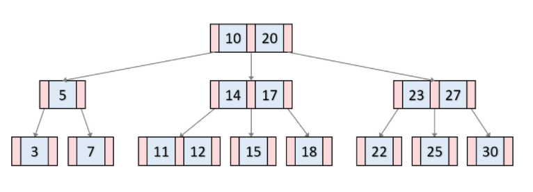
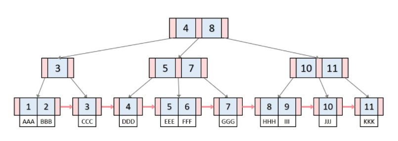

# B Tree, B+ Tree

### B Tree란??

- 이진트리와는 다르게 하나의 노드에 여러개의 정보를 가질 수 있고, 자식노드가 두 개로 한정되있지 않다!
- 사실 자식노드의 개수는 제한되어있는데, M차 B-Tree 일 때 M/2 ~ M개 까지의 자식을 가질 수 있다.
  - 예를 들어 위 사진은 3차 B-Tree라고 볼 수 있다. (2~3개의 자식노드를 갖는다.)
- 각 노드에는 (M/2 - 1) ~ (M - 1) 개의 정보, 즉 키를 가질 수 있다.
  - 3차 B-Tree는 1 ~ 2개의 키를 가질 수 있다.
- 모든 leaf node는 같은 level에 있어야 한다.
- node내의 모든 key값들은 오름차순으로 정렬되어있으며, 모든 key값에 데이터가 바로 옆에 저장되어있다.
- 모든 key값은 중복되지 않는다. - 사실 key라고 한 순간부터 중복되지 않는다는 뜻이 내포되어있다.

### B Tree의 Key 검색, 삽입, 삭제

- [링크](https://velog.io/@emplam27/%EC%9E%90%EB%A3%8C%EA%B5%AC%EC%A1%B0-%EA%B7%B8%EB%A6%BC%EC%9C%BC%EB%A1%9C-%EC%95%8C%EC%95%84%EB%B3%B4%EB%8A%94-B-Tree) 의 그림을 보면서 설명

### B+ Tree

- 사실 대부분 B Tree를 사용하기보단, data를 무작위&순차 열람이 쉬운형태로 저장할 수 있는 B+ Tree를 사용한다.

- B Tree와는 다르게 leaf node 외에는 데이터를 직접 가지고있지 않다. 따라서 데이터를 얻기 위해선, 무조건 leaf까지 내려와야한다.
- 모든 leaf node는 연결되어있는 연결리스트의 형태를 띄고있다. 이 때문에 연속적인 검색에 있어서 시간복잡도에서의 우위를 가지게 된다.
- 이를 '선형검색이 가능하다'라고 표현한다.

### B Tree의 Key 검색, 삽입, 삭제

- 검색과정은 B Tree와 동일하지만, 삽입과정에서 부모의 key가 변경되는 경우가 발생하거나, 삭제과정에서 merge가 일어날 수 있다.

- [링크](https://velog.io/@emplam27/%EC%9E%90%EB%A3%8C%EA%B5%AC%EC%A1%B0-%EA%B7%B8%EB%A6%BC%EC%9C%BC%EB%A1%9C-%EC%95%8C%EC%95%84%EB%B3%B4%EB%8A%94-B-Plus-Tree) 의 그림을 보면서 설명

### 활용

- 엄청나게 많은 양의 정보가 저장되어있을 때, 어떤 자료를 검색하기 위해서는 모든 자료를 일일히 비교해보며 찾아야한다.
- 이를 극복하기 위해 B Tree가 만들어졌다.
- 국가에서 국민의 정보를 저장하거나, 차량 정보를 저장하는 등 매우 다양한 분야의 데이터베이스 시스템의 저장방법으로 활용되고있다.

### 구현

- [링크](https://www.yeschan119.com/802b921a-3365-40bb-856a-94bc79097596)에서 python으로 B+ Tree를 구현했다.
- 데이터베이스를 다루는 DBMS프로그램들
  - Oracle Database, MySQL, SQLite, Microsoft Access

