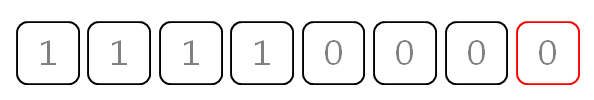
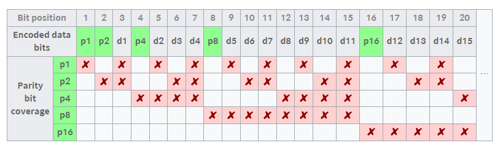

# Parity bit & Hamming code

### Parity bit

- 패리티 비트가 뭔가요?

  - 데이터에서 한 개의 비트를 덧붙여, 전달받은 정보가 오류가 생겼는지 검사하는 용도로 사용하는 비트. 패리티비트는 데이터의 1bit 오류를 검출할 수 있는 오류검출 장치이다.

    

  - 위 사진은 7bit의 데이터에 마지막 패리티 비트를 추가한 예시이다. [참고](https://dololak.tistory.com/33)

  - 패리티 비트는 두 종류가 있다.

    1. Odd(기수)방식 : 패리티 비트를 포함한 데이터의 합이 홀수가 되게하는 수를 패리티 비트로 넣는다.
    2. Even(우수)방식 : 패리티 비트를 포함한 데이터의 합이 짝수가 되게하는 수를 패리티 비트로 넣는다.

  - 이에 따르면, 위 사진은 Even방식 패리티 비트가 적용된 것이다.

    

  - 만약 위 사진처럼 첫 번째 비트가 소실되더라도 Even 방식의 패리티 비트가 적용되었다는 것을 안다면, 1이라는 것을 알 수 있을 것이다.

  - 이러한 방식을 가지기 때문에, 2bit이상의 소실 또는 왜곡이 일어난다면 패리티 비트를 통한 오류검사는 불가능하다고 볼 수 있다.

- 어떨 때 패리티 비트를 사용하나요?

  - 먼 거리, 혹은 외란이 발생할 수 있는 곳에서 신호를 주고받는 시리얼 통신
  - 정해진 소량의 데이터를 전송하는 지속적이지 않은 통신
  - 데이터의 오류를 검출했을 때, 데이터를 재요청 할 수 있는 환경에서의 통신

### Hamming code

- 해밍 코드가 뭔가요?
  - 이진 선형 블록 오류 정정 부호의 일종이다.
  - 2bit의 오류까지 감지할 수 있고, 1bit의 오류가 발생했을 때, 이를 수정할 수 있다.
  
- 해밍 코드 만들기

  - 해밍 코드는 n개의 데이터에 k개의 parity bit를 더한다.

  - n과 k는 다음 식과 같은 관계를 가진다

    `2**k – k – 1 >= n`

  - 만약 데이터 비트가 11개라면, 이를 만족하는 k의 최솟값은 4이므로 4개의 parity bit가 필요하다.

  - parity bit의 개수를 정했다면, `1, 2**1, 2**2 ~ 2**k-1`의 위치에 parity bit를 위치시킨다.

  - 각 위치에 배치된 parity bit의 순서가 m번째 parity bit라고 할 때, 자신의 위치부터 시작해 `2**m`개의 bit를 담당하고, `2**m`개를 건너뛴 다음 다시 `2**m`개, 이런 식으로 마지막 데이터까지 관할구역을 갖게 된다. 이는 표를 보면 규칙에 대한 이해가 쉬울것이다.

  

- 해밍 코드 해석  /  [참고](https://dreamlog.tistory.com/578)

  - 위의 표에서 볼 수 있듯이, 하나의 데이터 비트에 오류가 검출된다면 어떤 parity bit에서 오류가 검출되었나 확인함으로 어떤 데이터 비트가 오류인지 알 수 있게 된다.
  - 예를 들어 d9에 오류가 발생했을 경우, p1, p4, p8에서 오류가 검출되게되는데, 이러한 검출양상을 보이는 데이터 비트는 d9가 유일하기때문에 바로 알 수 있다.
  - 또한 parity bit의 규칙에 따라, 각 Odd, Even 여부로 적절한 데이터 비트가 무엇인지 알 수 있기 때문에 오류를 수정할 수 있다.

