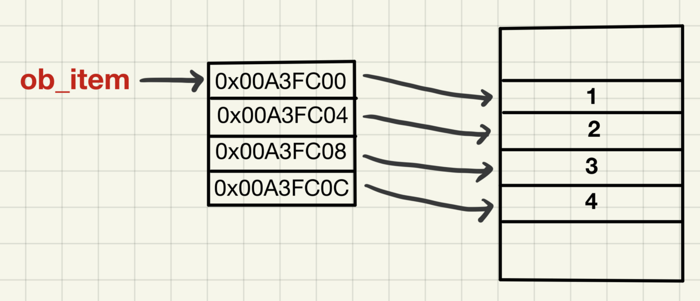

# Queue

### FIFO 구조


- Rear에서 입력을 받고, Front에서 출력을 한다.
- FIFO (First In First Out) 구조로, 가장 먼저 들어온 자료가 가장 먼저 나온다.
- Stack과 다르게, Rear와 Front, 두 개의 위치에서 접근이 가능하다.


### 활용

- 버퍼 : 입력되는 내용이 매우 많을 때, 임시적으로 저장해놓고, 나중에 사용하고 싶을 때
- sys.stdin : stdin은 Standard input으로 표준입력을 뜻하는 말이다. 일반적으로 키보드가 되고, 이는 Queue의 구조로 저장이 된다.


### Queue

- isEmpty()
  - 비어있는지 확인하는 동작
  - `return False if <queue> else return True`로 구현할 수 있다. queue가 비어있다면 조건문에서 거짓으로 인식되기 때문에 True가 반환되고, queue에 하나라도 원소가 있는 경우 False가 반환된다.
- isFull()
  - 정해진 크기만큼 가득 차있는지 확인하는 동작
  - `return len(<queue>)==self.size`로 구현할 수 있으며, size는 미리 정의되어있어야한다.

- enQueue()
  - 데이터를 추가하는 동작
  - `list.append(<data>) if not self.isFull()`로 구현할 수 있다.
  - Rear의 index가 1 늘어나게 된다.
- deQueue()
  - 데이터를 꺼내는 동작
  - `return list.pop(0) if not isEmpty() else return None`으로 구현할 수 있다. pop함수의 인자가 0이면 처음 인덱스, Front인덱스를 꺼내고 삭제함을 이용한 것이다.
  - Front가 제거되므로, 모든 요소의 index가 1 줄어들고, 새로운 Front가 생기게 된다.

- 이를 구현한 클래스는 다음과 같다.

  ```python
  class MyQueue:
      def __init__(self, size):
          self.size = size
          self.queue = list()
          
      def isEmpty(self):
          if self.queue:
              return False
          else:
              return True
         
      def isFull(self):
          return len(self.queue)==self.size
      
      def enQueue(self, data):
          if not self.isFull():
              self.queue.append(data)
      
      def deQueue(self):
          if not isEmpty():
              return self.queue.pop(0)
          else:
              return None
  ```


### 연결리스트 큐

- 파이썬에서는 연결리스트 큐의 구현을 할 필요가 없다.



- 사실 python의 리스트는 C언어와는 다르게 각 원소들의 포인터를 저장하는 방식으로 저장되고, 이를 통해 무작위 접근에 최적화 된 자료형이기 때문에 연결리스트의 구현과 관계없이 제한없이 큰 크기를 가지게 할 수 있다.
- [파이썬 리스트 내부구조](https://seoyeonhwng.medium.com/%ED%8C%8C%EC%9D%B4%EC%8D%AC-%EB%A6%AC%EC%8A%A4%ED%8A%B8-%EB%82%B4%EB%B6%80-%EA%B5%AC%EC%A1%B0-f04847b58286)


### Deque(데크)

- **Double-ended queue**의 약자로, 데이터를 <ins>양방향</ins>에서 추가, 제거할 수 있는 자료구조이다.
- Rear와 Front에서 추가와 제거를 모두 할 수 있어 스택처럼, 또는 큐처럼 사용할 수 있다.
- 아래서 설명할 queue라이브러리의 put과 다르게 순회하여 Front로 도달하지 않기 때문에 양 끝점에 도달하는 속도가 비교적 매우 빠르다.
- push와 pop을 자주하는 알고리즘에서 이용한다면 최적화가 쉬울것이다.


### python에서의 Queue

- Queue는 파이썬 기본 라이브러리에 포함되어있고, 이를 import함으로 쉽게 사용할 수 있다.

```python
from queue import Queue

q = Queue()

# enQueue
q.put(1)

# deQueue
q.get()

# isEmpty
q.empty()

# isFull
q.full()
```


- dequeue는 collections에 존재한다.

```python
from collections import deque

dq = deque([2,3])

dq.appendleft(1) ### dq = [1,2,3]
dq.append(4) ### dq = [1,2,3,4]
dq.popleft() ### 1
dq.pop() ### 4

items = [10, 11, 12]
dq.extend(items) ### dq = [2, 3, 10, 11, 12]
for num in items
	dq.remove(num) ### dq = [2, 3, 11, 12] -> [2, 3, 12] -> [2, 3]
dq.extendleft(items) ### dq = [12, 11, 10, 2, 3]

dq.rotate(2) ### dq = [2, 3, 12, 11, 10]
dq.rotate(-1) ### dq = [3, 12, 11, 10, 2]
```

- appendleft(), popleft()의 존재로 Rear의 요소에도 접근이 가능하다.
- extend()로 iterable을 추가할 수 있다.
- rotate로 요소들의 회전이 가능하며, 양수 음수 모두 가능하다.


