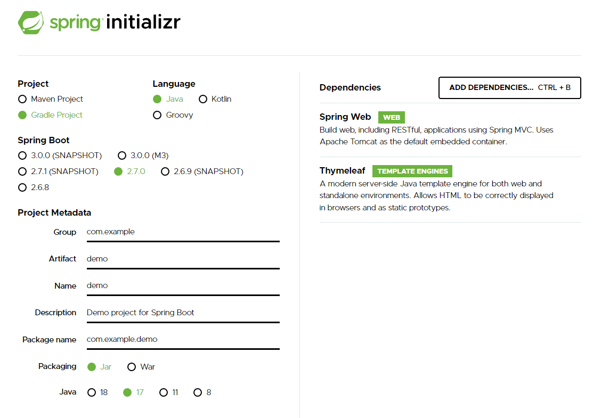
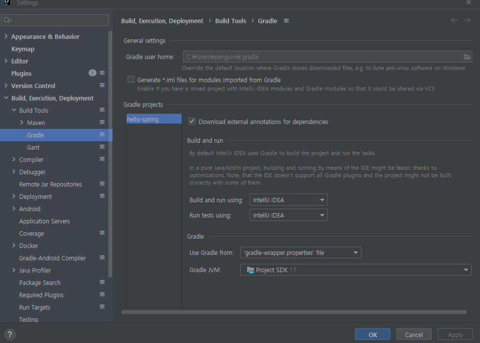
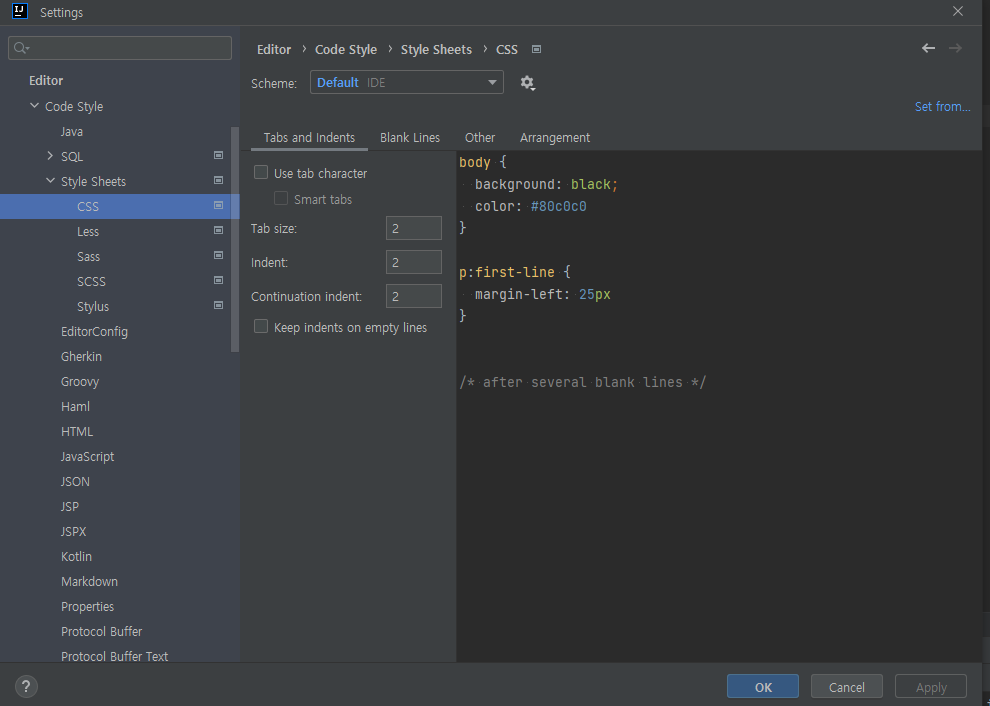
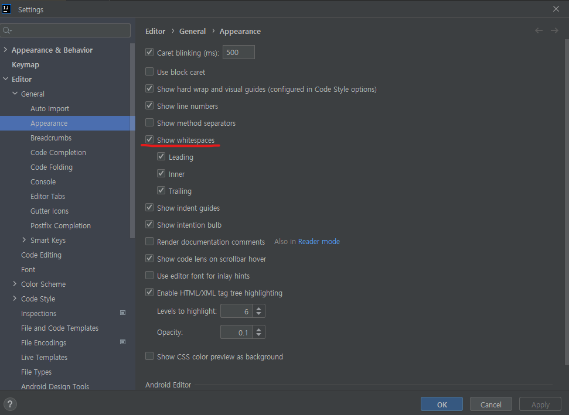
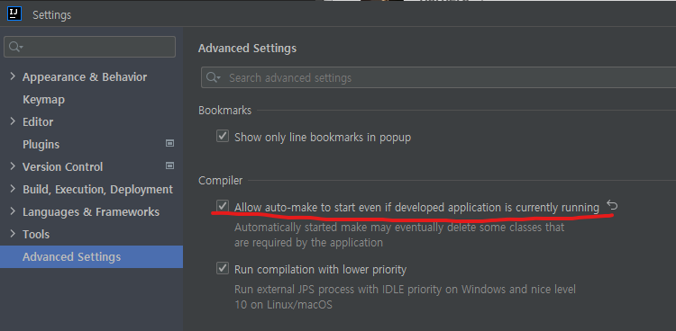
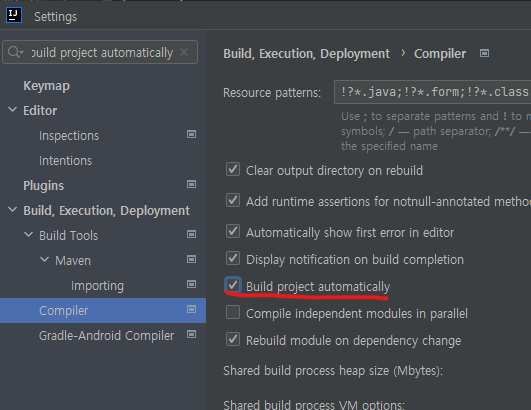
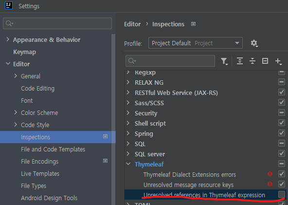
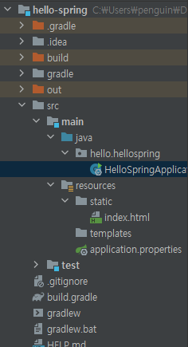

# 스프링 시작하기

### 사용 프로그램

- IntelliJ
- java 17


### spring 프레임워크 받아오기

[start.spring.io](https://start.spring.io/)에 접속한 뒤, 아래와 같은 설정으로 다운받았다.

 

- Project - Gradle Project
- Spring Boot - 안정적인 버전 중 최신, 2.7.0
- Dependencies - `Spring Web`, `Thymeleaf`

아래 GENERATE를 누르면 zip파일이 받아지고, 압축을 푼 뒤, intelliJ로 폴더를 열면 된다.


### Settings

 

- Gradle 검색해서 나온 화면에서 Build and run using과 Run tests using을 바꿨다.
- Gradle로 run하게되면 느려진대서 바꿈


 

- HTML과 CSS의 탭간격을 모두 2로 바꿔줌


 

- 탭 공백을 표시하기위한 설정


```java
// build.gradle

dependencies {
	...
	developmentOnly('org.springframework.boot:spring-boot-devtools')
}
```

 

 

- 서버를 껐다 켜지 않아도 자동으로 반영되게 하는 작업


 

- html의 변수부분에 밑줄이 생기는 현상을 없애줌


### 서버 켜보기

 

`src/main/Java/{project_name}.hellospring/HelloSpringApplication.java`를 run하면 된다.

우클릭하고 run하면 되고, 중지시키고 싶을땐 왼쪽 하단의 빨간색 중지버튼을 누르면 된다.