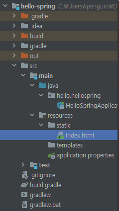
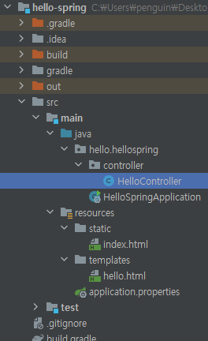

# Welcome Page 만들기

### index.html 만들기

기본적으로, 정적페이지는 `src/main/resources/static/`에 담긴다.

 


### 새로운 컨트롤러 만들기

`src/main/java/{project_name}.hellospring/`에 새로운 패키지를 생성한 뒤, 새로운 java class를 생성해주었다.

 

코드는 다음과 같이 작성했다.

```java
package hello.hellospring.controller;

import org.springframework.stereotype.Controller;
import org.springframework.ui.Model;
import org.springframework.web.bind.annotation.GetMapping;

@Controller
public class HelloController {

    @GetMapping("hello")	// GET요청에 응답한다는 뜻
    public String hello(Model model){	// Model을 model로 상속받음
        model.addAttribute("data", "hello!!");	// 넘겨줄 데이터 이름, 데이터
        return "hello";		// src/main/resources/templates 에서 해당 이름의 html을 찾음
    }
}
```

- `local:8080/hello/`의 GET요청이 들어오면 응답하는 함수를 만들었다.
- html문서에서 사용할 'data'라는 변수를 넘겨주기위해 `model.addAttribute`를 작성했다.
- templates의 hello.html을 찾아 응답하도록 `return "hello"`라고 작성되어있다.
  - viewResolver가 이 작업을 해준다.
