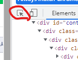
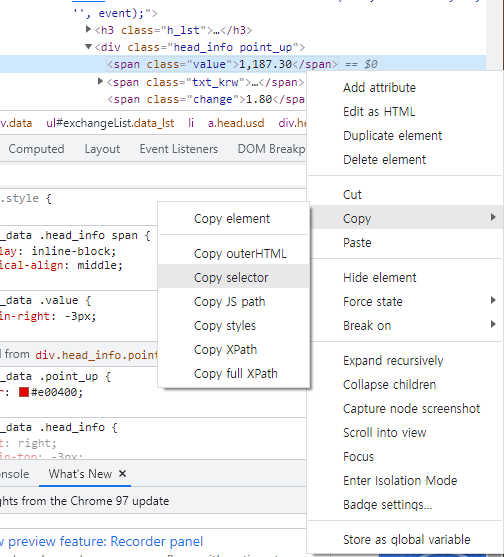

01-14

### git, github 응용 + requests 라이브러리

#### .git ignore

- README.md와 같이 .gitignore도 처음에 같이 만들어준다.
- .gitignore 안에 이름이 있으면 그 파일은 git에서 없는 취급한다.

- 보통 라이브러리같은건 ignore해서 알아서 사용자가 구하도록 할 때 사용한다.

- [gitignore](https://gitignore.io)에서 미리 만들어진 ignore구문을 받을 수 있다.
  - python, windows, visualstudiocode, pycharm, venv, django 를 검색해 정크파일들을 무시하는 구문 받기


#### branch 복습

`git switch {}`와 `git checkout {}`는 비슷하지만, switch가 최신문구이다.

```
git log --oneline --all --graph
```

위 구문으로 모든 branch를 그림처럼 나타낼 수 있다.


#### reset, revert

```
git reset --hard {commit 앞 4자리}
git revert {commit 앞 4자리}
```

커밋의 상태로 되돌아간다. --hard 때문에 다 지워버리기 때문에 조심해서 사용.

revert는 기록을 남기면서 과거 커밋으로 간다.


#### python - requests

페이지 개발자 도구에서 



버튼을 누르면 엘리멘트에 마우스를 갖다대서 원하는 코드에 접근이 가능하다.



Copy selector를 선택하면, 원하는 엘리먼트의 변수명을 불러올 수 있다.

```python
import requests
from bs4 import BeautifulSoup


url = 'https://finance.naver.com/marketindex'
response = requests.get(url).text
data = BeautifulSoup(response, 'html.parser')
exchange = data.select_one('#exchangeList > li.on > a.head.usd > div > span.value')
result = exchange.text

print('현재 원/달러 환율은 ' + result + '입니다.')
```

변수명은 위에서 select_one메서드의 매개변수로 사용